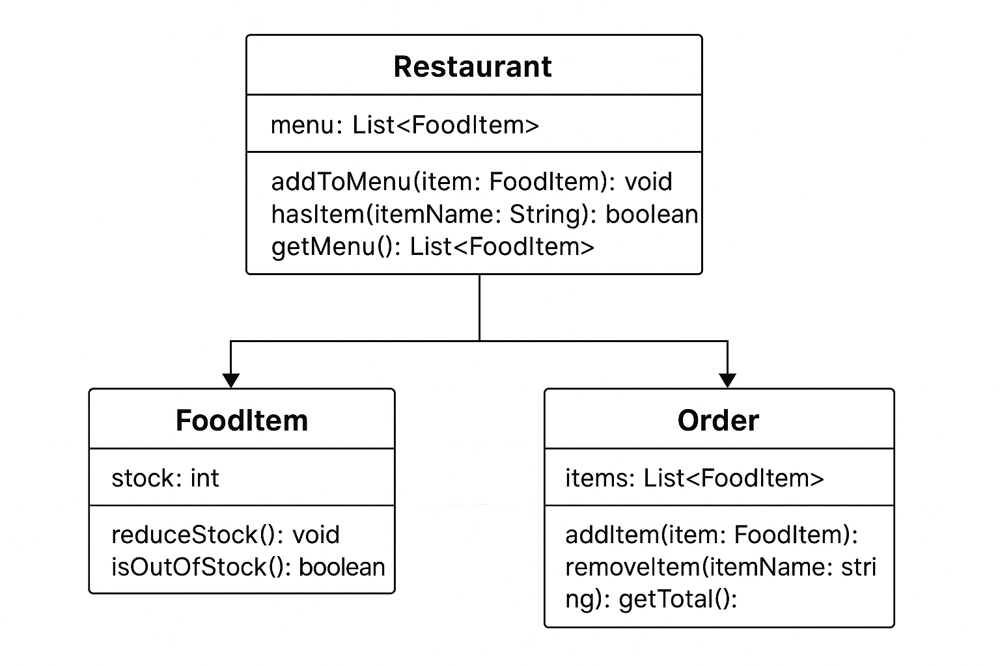

# 🍽️ E-Dine Cart

A **mini console-based food ordering system** built in **Java 11** with **JUnit 5** for testing.  
This project demonstrates **QA-focused development**, inventory management, and real-world workflows like menu handling, stock reduction, and order validation.

---

## 🚀 Features
- Restaurant can create a **menu** with items, prices, and stock levels.
- Customers can **place orders** with quantity input.
- **Stock management** ensures items cannot be ordered if unavailable.
- Handles **invalid inputs** (0 or negative quantities).
- Items with stock `0` are shown as unavailable → basic **inventory management**.
- Includes **JUnit 5 test cases** for functional, negative, and exception scenarios.

---

## 🛠️ Tech Stack
- **Language:** Java 11  
- **Testing:** JUnit 5  
- **Build/Run:** javac & java CLI (with standalone JUnit jar)

---

## 📂 Project Structure
```
E-Dine-Cart/
 ├── lib/
 │    └── junit-platform-console-standalone-1.9.3.jar
 ├── src/
 │    ├── FoodItem.java
 │    ├── Restaurant.java
 │    ├── Order.java
 │    └── Main.java
 └── test/
      └── FoodOrderTest.java
```

---

## ▶️ How to Run

### 1. Compile
```bash
javac -cp lib/junit-platform-console-standalone-1.9.3.jar:./src:./test ./src/*.java ./test/*.java
```

### 2. Run Interactive App
```bash
java -cp ./src Main
```

### 3. Run JUnit Tests
```bash
java -jar lib/junit-platform-console-standalone-1.9.3.jar -cp ./src:./test --scan-classpath
```

---

## 🖥️ Sample Run (Console)
```
🍽️ Welcome to E-Dine Cart!
Note: Enjoy delicious food at affordable prices.

📋 MENU:
Pizza - ₹250.0
Pasta - ₹180.0
Coke - ₹50.0
Burger - ₹120.0

Type 'done' when finished.

Enter item name to order (or 'done'): Pizza
Enter quantity: 2
✅ Added 2 x Pizza to cart

Enter item name to order (or 'done'): Coke
Enter quantity: 5
⚠️ Out of stock: Coke

Enter item name to order (or 'done'): done

🛒 Final Order Summary:
Total items in cart: 2
Total Bill: ₹500.0
```

---

## UML Diagram



---

## ✅ JUnit Test Coverage
- Add & fetch menu items
- Handle invalid menu requests
- Order items and reduce stock
- Prevent ordering out-of-stock items
- Reject zero/negative quantities
- Validate empty order scenario

---

## 🔮 Future Enhancements
- **Admin & Customer separation**: Admin manages inventory, Customer places orders.
- **Customization options**: Add toppings, size selection, combo offers.
- **Discount/Coupon system**.
- **Database integration (MySQL/SQLite)** for persistence.
- **REST APIs + Postman tests** for QA automation.
- **Frontend UI (JavaFX / Web)** to replace console interface.

---

## 👩‍💻 Author
**Somya**  
- [LinkedIn](https://linkedin.com/in/somya-8542a8250)  
- [GitHub](https://github.com/SOMYAJ-svg)  
